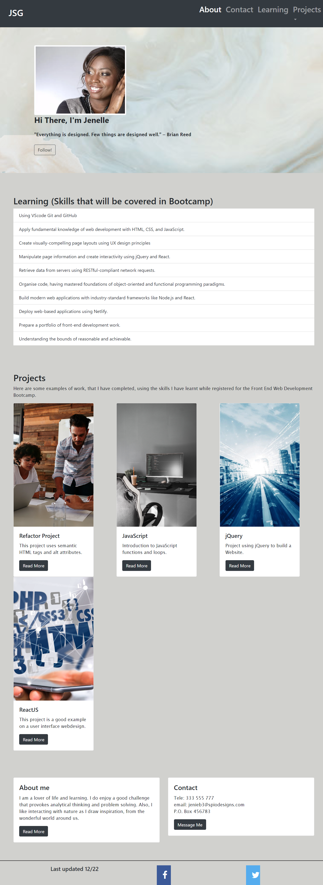

# Jenelle-Bootstrap-Portfolio
Jenelle's Portfolio using Bootstrap

## Description
One of the problems facing developers is time spent on writing code. This project makes good use of Bootstrap which is a CSS framework used to make webpages responsive. Compared to my last project using HTML and CSS-flexbox, I was able to complete in a faster time and my project does look more professionally laid out. I found the bootstrap framework very useful in laying out cards and making list. I would recommend this for beginners who may find writing code tedious or like me found flexbox "grid container" concept challenging.

## Installation

N/A
## Usage

This project can be used as a refactor project, or an example of what one can acheive with Bootstrap CSS framework.

## Credits
I found the following websites useful during this project.
https://www.w3schools.com/howto/howto_css_social_media_buttons.asp
https://getbootstrap.com/docs/5.2/layout/grid/
https://www.youtube.com/watch?v=4sosXZsdy-s

## License
Please refer to license in repo.

## Screenshot

